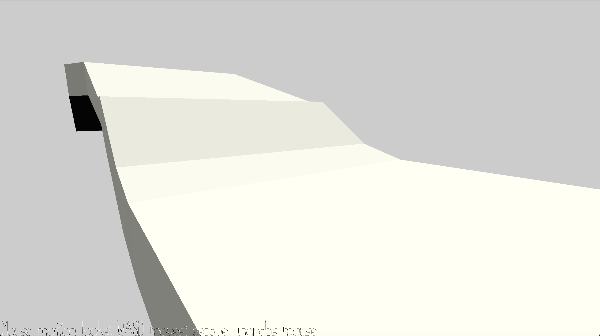

# Just Walk Nowhere

Author: Nellie Tonev

Design: There is not a functioning game since every time I tried to add something interesting to the scene, it seemed to keep messing
up the WalkMesh. The WalkMesh is implemented, and you can walk down a bumpy path to the end. 

The state of the past couple games has been a bit unfortunate and embarrassing, but hopefully game6 and final game will be better. :')

Screen Shot:

How To Play:
* Camera controls are the same as the default (click and move mouse to move camera, escape to ungrab)
* Use WASD to move character around.

Sources: All assets created by me using Blender.

This game was built with [NEST](NEST.md).

